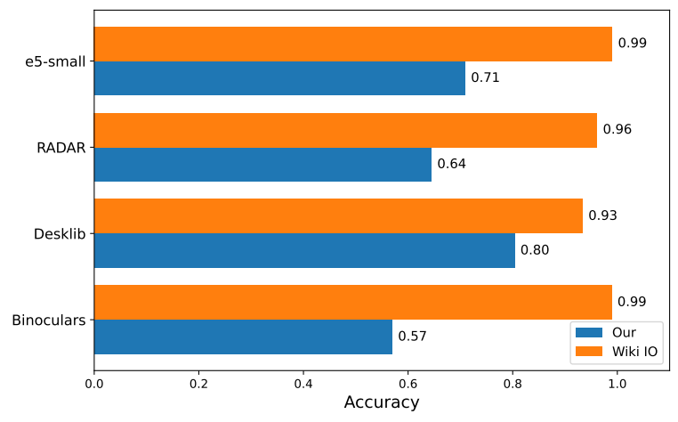
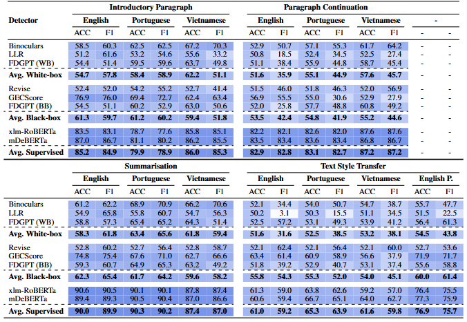
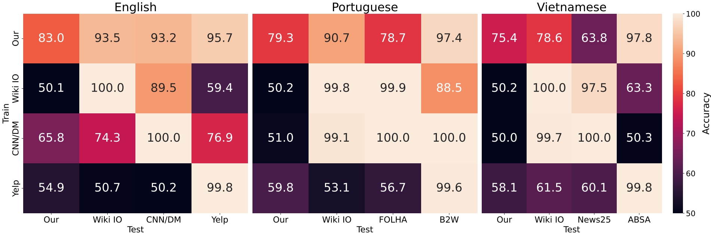
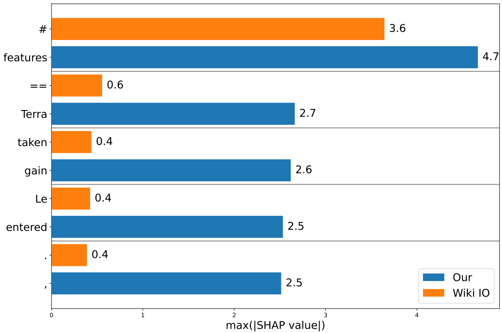
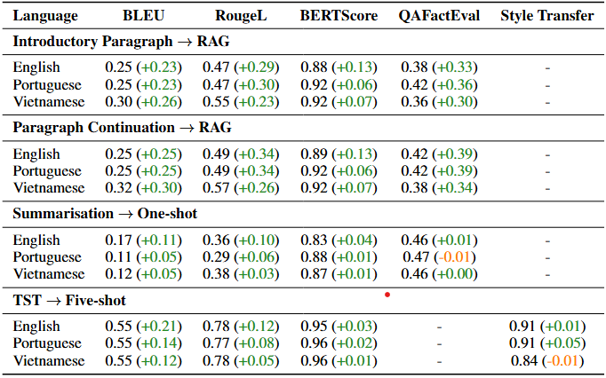

# WETBench: A Benchmark for Detecting Context-Conditioned Machine-Generated Text across Common Editing Tasks on Wikipedia

This repository contains the official implementation of **WETBench: A Benchmark for Detecting Context-Conditioned Machine-Generated Text across Common Editing Tasks on Wikipedia**.

<!-- Add link: [Paper Title]() -->

---

## Abstract

Detecting machine-generated text (MGT) on user-generated content (UGC) platforms is critical due to the persistent limitations of large language models (LLMs).
Users increasingly leverage LLMs for editing tasks that require *context-conditioned* generation. However, existing MGT detection benchmarks overwhelmingly focus on simple *instruction-only* generation tasks, leaving real-world detection performance on UGC platforms such as Wikipedia largely unexplored.
In this work, we show that most trained state-of-the-art detectors struggle to detect context-conditioned MGT. 
We introduce **WETBench**, a multilingual, multi-generator, and multi-task benchmark that reflects common Wikipedia editing scenarios, where generation is guided by detailed context. Our evaluations reveal that (i) detector accuracy drops by 5–18% compared to prior benchmarks, and (ii) a generalization asymmetry emerges: fine-tuning on context-conditioned MGT supports transfer to instruction-only MGT—even across domains—but not vice versa.
We attribute this asymmetry to overfitting: detectors trained solely on instruction-only MGT learn to exploit superficial artifacts, failing to generalize to more complex, context-driven generations. These findings suggest that prior benchmarks overestimate real-world detection performance. More broadly, our results indicate that reliable MGT detection—essential for safeguarding the integrity of UGC platforms—may already be approaching the limits of current detection methods.

---

## Requirements

### 1. Clone the Repository

```bash
git clone https://github.com/gerritq/WETBench
cd WETBench
```

### 2. Download Pretrained Models

We host the pre-trained models for Experiment 2 (generalisation) on Google Drive. You can also run the models yourself using the script `generalise/code/train_hp_g.sh`.  
The following script will download and unzip the models into `generalise/code/hp_len`.  
The download is ~18GB, unzipped size is ~25GB.

```bash
bash download_models.sh
```

**Note:** This script requires `gdown`. Install it via:

```bash
pip install gdown
```

---

### 3. Set Up the Python Environment

We recommend using a virtual environment to manage dependencies.

```bash
python3 -m venv venv
source venv/bin/activate
pip install --upgrade pip
pip install -r requirements.txt
export HF_HOME="" # optimal to manage hf cache
```

---

## Main Results

**Note:**  
- Experiment 1 was run on either a single **NVIDIA A100 80GB** or two **NVIDIA A100 40GB** GPUs.  
- Experiment 2 was run on a single **NVIDIA A100 80GB**.  
- We strongly recommend using GPUs to replicate results.

### Experiment 1: Detector Performance on Context-Conditioned MGT

#### SOTA Off-the-Shelf Detectors



Run the following script to reproduce the results:

```bash
bash run_ots.sh
```

#### Trained Detectors by Task–Language–Detector Combination



To run black-box detectors, provide your OpenAI API key. If you skip this, only local models will be evaluated.

**Note:**  
Zero-shot evaluations may take up to 1.5 days. We recommend splitting scripts across HPC jobs.  
Supervised detectors run much faster. To run only those:

```bash
bash detect_train_hp.sh
```

To run all:

```bash
export OPENAI_API_KEY=sk-... # Optional
bash run_detection.sh
```

---

### Experiment 2: Generalisation



This will populate `generalise/data/detect` with files named:
`trainFile_2_testFile_model_language.jsonl`

```bash
bash run_generalisation.sh
```

---

### Experiment 2: SHAP Value Analysis



To generate the SHAP plot `assets/shap_vals.pdf`:

```bash
bash run_shap_vals.sh
```

---

## Other Results

### Prompt Selection



You can run this without `QAFactEval` if it causes issues.

To replicate our prompt selection evaluation:

#### 1. Create a Conda Environment for QAFactEval

We recommend using Conda: Clone and install QAFactEval into the current directory:

```bash
conda env create -f environment_qafe.yml
pip install -r requirements_qafe.txt
```

Clone and install QAFactEval into the current directory. Follow setup instructions at: https://github.com/salesforce/QAFactEval. Don't forget to add the `model_folder` in `scorers/qafe.py`.

#### 2. Download Style Classifiers

Same procedure as above. Ensure `gdown` is installed.

```bash
bash download_sc.sh
```

#### 3. Run the Evaluation

This example runs the evaluation for Vietnamese. Adjust the language as needed.

```bash
bash run_prompt_eval.sh
```

---

## Data Collection

We provide all data (WikiPS, mWNC, and MGTs) via [Hugging Face](https://huggingface.co/datasets/cs928346/WETBench).

Below is how to reproduce our datasets.

---

### WikiParas

To reproduce our paragraph and summary data:

1. Download the latest Wikimedia dumps. Replace `${lang}` with one of `[en, pt, vi]`.

> **Note:** English dump is >660GB.

```bash
mkdir -p data
wget -P data https://dumps.wikimedia.org/enwiki/20190120/${lang}wiki-latest-stub-meta-history.xml.gz  
gunzip data/${lang}wiki-latest-stub-meta-history.xml.gz
```

2. a) Get the latest articles  
   b) Query the MediaWiki API for HTML  
   c) Extract the base sample

If using languages beyond ours, adapt the `parse_infobox` and similar functions.

```bash
bash collection/1_get_latest_articles.sh
bash collection/2_query.sh
bash collection/3_get_text.sh
```

This creates `3_${lang}_text.jsonl`, the base file for the following:

```bash
bash paragraphs/data/gen_paras.sh
bash summaries/data/gen_sums.sh
```

The generated datasets are stored in `paragraphs/data/` and `summaries/data/`.

---

### mWNC

To extend mWNC (following Pryzant et al. 2020):

> **Note:** Requires the Wikimedia dumps from above.

1. Get all NPOV-related revisions.

```bash
bash tst/data/1_get_nrevs.sh
```

2. Crawl diffs (recommended: use HPC array jobs to parallelise).

```bash
bash tst/data/2_get_crawl.sh
```

3. Process the data.

```bash
bash tst/data/3_process.sh
```

4. Generate sentence-level datasets for all languages, and paragraph-level for English:

```bash
bash tst/data/4_gends.sh
bash tst/data/5_get_paras.sh
```

---

## Contributing

Valuable contributions include:

- Implementing robust data cleaning with [`mwparserfromhtml`](https://pypi.org/project/mwparserfromhtml/)
- Extending to more languages, adding generators, and expanding task coverage

---

## Citation

> tbd
